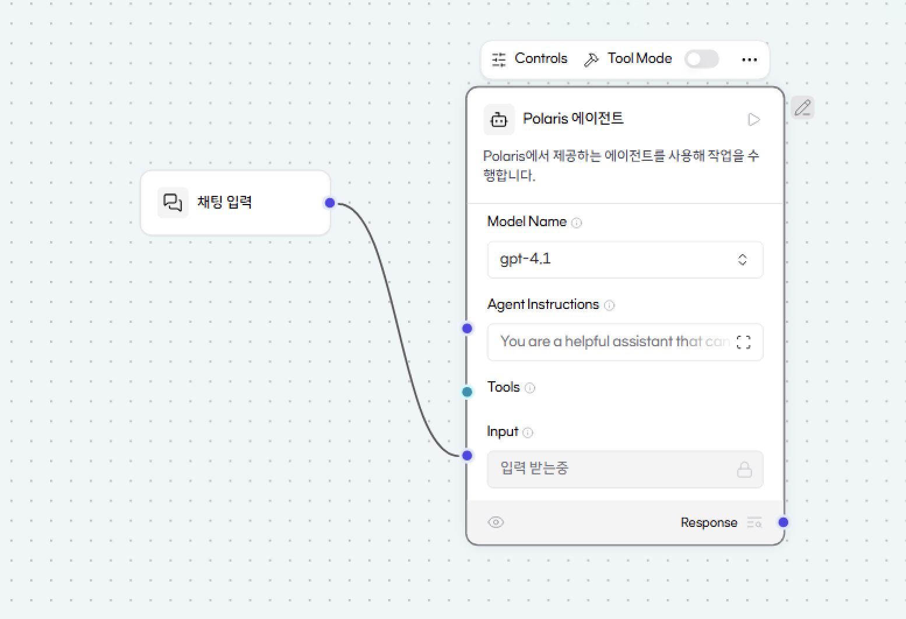
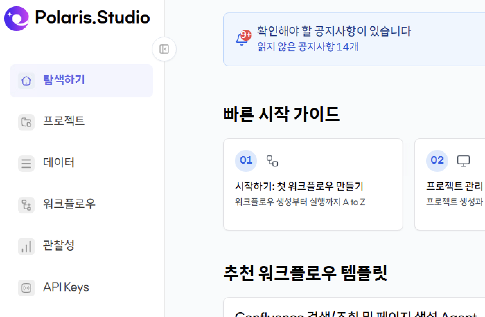
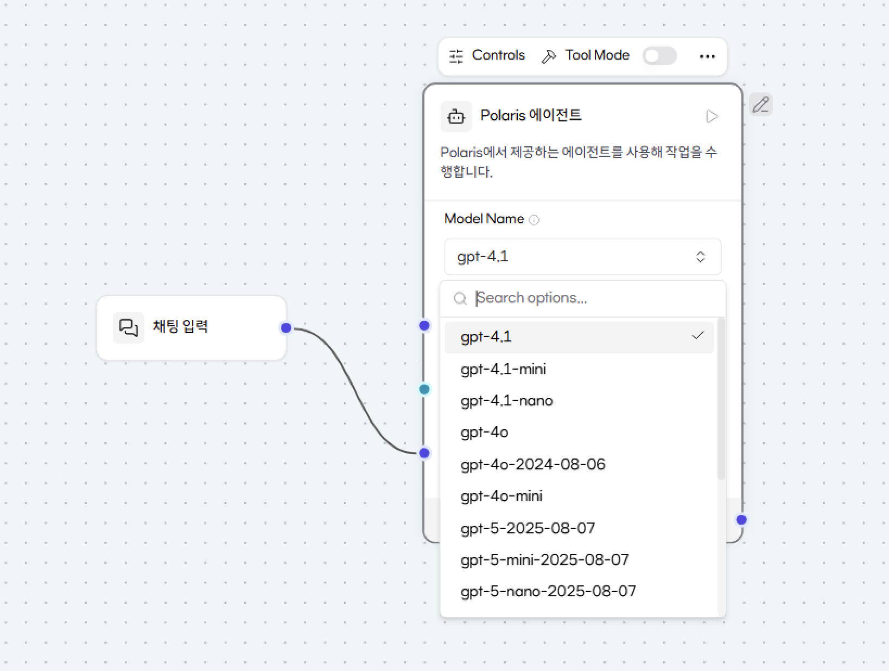

# 🛠️ SKT Polaris.Studio 

'Canvas' 위에서 펼쳐지는 AI 업무 혁신
Polaris.Studio는 SKT 내부 환경에 최적화된 '노코드 AI 워크플로우 빌더'입니다. 복잡한 코딩 없이도 마치 캔버스에 그림을 그리듯, 사내 데이터와 AI 모델을 조립하여 업무 자동화를 실현하는 통합 플랫폼입니다.

## 🎨 작업 공간: Canvas (The Creative Workspace)

Polaris.Studio의 핵심은 모든 아이디어가 구체화되는 'Canvas'에 있습니다.

 시각적 빌딩: 사용자는 Canvas라는 빈 도판 위에 필요한 기능(Component)을 끌어다 놓습니다.
직관적 연결: 배치된 컴포넌트 사이를 선으로 연결하여 데이터의 흐름과 업무 로직을 설계합니다.
실시간 확인: Canvas 위에서 워크플로우의 전체 구조를 한눈에 파악하고, 즉시 테스트하며 완성도를 높일 수 있습니다.

## 🏗️ Polaris.Studio의 3단계 계층 구조

Canvas 위에서 구현되는 작업은 효율적인 관리를 위해 다음과 같은 위계를 가집니다.

- Project (Root Level): 하나의 큰 업무 테마입니다. (예: '고객 센터 자동 응대 프로젝트') Canvas에서 만들어진 여러 워크플로우를 하나의 폴더처럼 묶어서 관리합니다.
- Workflow (Process Level): Canvas 위에서 실제로 선으로 연결된 '작업의 흐름도'입니다. 입력부터 AI 처리, 결과 출력까지의 전체 경로를 의미합니다.
- Component (Unit Level): Canvas에 배치되는 '최소 기능 블록'입니다.

    - LLM: 생각하는 두뇌
    - Input/Output: 데이터의 시작과 끝
    - Filter/Logic: 데이터를 가공하고 판단하는 필터
    
## 🌟 Polaris.Studio가 제공하는 3대 핵심 가치

Internal First (철저한 보안): MAMF, DataLake 등 SKT 사내 데이터와 Canvas를 직접 연결하여 가장 안전하고 빠르게 지식 기반 AI를 구축합니다.
LLM + Logic (지능형 자동화): AI의 추론 능력에 사용자가 Canvas 위에 설계한 비즈니스 로직을 결합하여 실질적인 업무 가치를 창출합니다.
All-in-One Platform (통합 환경): RAG(검색), Tool(도구), Automation(자동화) 등 모든 기능을 Canvas라는 하나의 공간에서 조립할 수 있습니다.

### 최종 요약 
Polaris.Studio는 SKT의 방대한 사내 지능을 Canvas라는 자유로운 작업 공간으로 끌어온 플랫폼입니다. 누구나 이 Canvas 위에서 컴포넌트를 연결하는 것만으로, 자신만의 강력한 AI 에이전트를 가질 수 있습니다.

