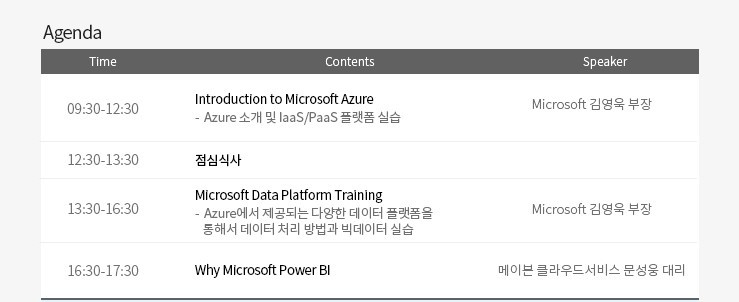

- 화장실은 들어온 입구로 나가셔서 왼쪽에 있습니다. 
- 홀에 있는 커피 (원두 및 커피머신)은 자유롭게 사용해 주시면 됩니다. 
- 인터넷은 MSFT_GUEST 로 접속하시면 됩니다. 접속 후 Event 코드는 msevent490ah를 입력하시면 됩니다.  
- 실습에는 Microsoft 계정이 필요합니다. 계정이 없거나 기억나지 않으시는 분들은 [https://signup.live.com](https://signup.live.com) 에서 다시 만들어 주시기 바립니다.

오전 내용 HOL은 Microsoft Learn을 기반으로 클라우드 서비스의 IaaS와 PaaS를 설명해 드립니다. 
   
1. Azure 기본 사항 
[https://docs.microsoft.com/ko-kr/learn/paths/azure-fundamentals/ ](https://docs.microsoft.com/ko-kr/learn/paths/azure-fundamentals/ )

2. Azure Virtual Machine을 통한 웹 배포 
[https://docs.microsoft.com/ko-kr/learn/paths/deploy-a-website-with-azure-virtual-machines/ ](https://docs.microsoft.com/ko-kr/learn/paths/deploy-a-website-with-azure-virtual-machines/ )

3. Azure Web Service로 웹 사이트 배포 
[https://docs.microsoft.com/ko-kr/learn/paths/deploy-a-website-with-azure-app-service/ ](https://docs.microsoft.com/ko-kr/learn/paths/deploy-a-website-with-azure-app-service/ )

4. 서버 리스 응용 프로그램 만들기 
[https://docs.microsoft.com/ko-kr/learn/paths/create-serverless-applications/ ](https://docs.microsoft.com/ko-kr/learn/paths/create-serverless-applications/ )

5. 참고자료 
[https://github.com/KoreaEva/HOL/blob/master/Azure/20190108_Korea_University/microsoftazure-technicaloverview-170405213706.pdf](https://github.com/KoreaEva/HOL/blob/master/Azure/20190108_Korea_University/microsoftazure-technicaloverview-170405213706.pdf)

## Lunch time 

1. Azure에 데이터 저장 
[https://docs.microsoft.com/ko-kr/learn/paths/store-data-in-azure/](https://docs.microsoft.com/ko-kr/learn/paths/store-data-in-azure/)

2. Azure SQL Database를 프로비전하여 애플리케이션 데이터 저장 
[https://docs.microsoft.com/ko-kr/learn/modules/provision-azure-sql-db/](https://docs.microsoft.com/ko-kr/learn/modules/provision-azure-sql-db/)

3. Azure Cosmos DB의 NoSQL 데이터 작업 [https://docs.microsoft.com/ko-kr/learn/paths/work-with-nosql-data-in-azure-cosmos-db/](https://docs.microsoft.com/ko-kr/learn/paths/work-with-nosql-data-in-azure-cosmos-db/)

4. Azure Cosmos DB를 사용하여 전세계에 데이터 배포 
[https://docs.microsoft.com/ko-kr/learn/modules/distribute-data-globally-with-cosmos-db/](https://docs.microsoft.com/ko-kr/learn/modules/distribute-data-globally-with-cosmos-db/)