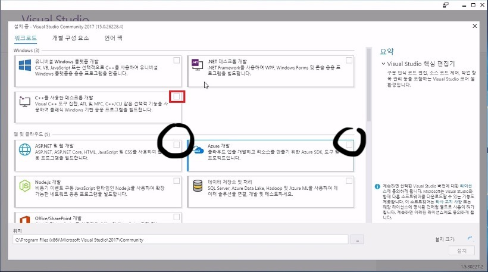
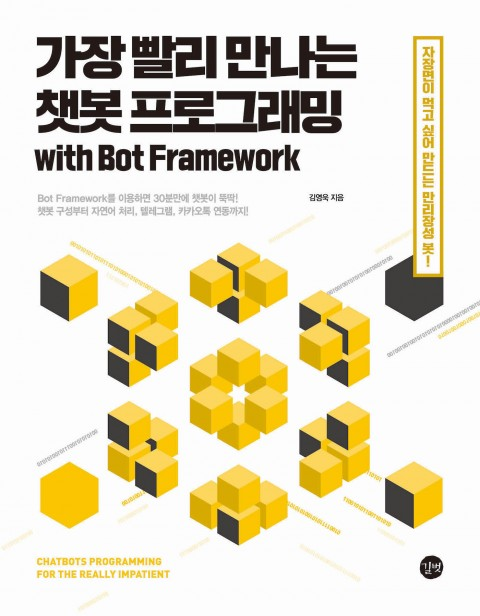

# 20190216 LangCon 가장빨리 만나는 챗봇 프로그래밍 HOL
가장 빨리 자연어 처리와 텍스트 마이닝 기술이 적용된 챗봇을 개발하고 싶은 사람들을 위한 Hands on Labs 세션입니다. 이 세션에서는 Microsoft Bot Framework를 사용해서 개발하고 있으며 Azure 기반으로 서비스 해 봅니다.

## 준비사항 (사전에 설치해 주세요)
- Windows 7 or 10 (Mac OS는 지원되지 않습니다.)
- Visual Studio 2017 Community or Higher.
 [https://visualstudio.microsoft.com/ko/downloads/](https://visualstudio.microsoft.com/ko/downloads/) 
 
 [중요!!!]Visual Studio를 설치 할 때에는 설치 옵션에서 ASP.NET 및 웹 개발과 Azure 개발 두 항목에 반드시 체크를 해주셔야 합니다.
  이미 설치하신 분들도 Visual Studio Installer를 실행 시킨 다음 해당 옵션에 체크가 되어 있는지 확인 해 주시기 바랍니다. 
- Bot Emurator 
  아래 링크에서 본인의 OS에 해당되는 설치 본을 다운로드 받을 수 있습니다. [https://github.com/Microsoft/BotFramework-Emulator/releases](https://github.com/Microsoft/BotFramework-Emulator/releases)
- Slack
Hands on Labs 진행시에 소통을 Slack으로 합니다. 링크나 소스 등을 전달해 드릴 예정입니다. 반드시 Windows 10 사용자는 앱버전을 아닌 사용자들은 Desktop 버전을 설치해 주시기 바랍니다. [https://slack.com/downloads/windows](https://slack.com/downloads/windows)

## 추천도서
가장 빨리 만나는 챗봇 프로그래밍 
