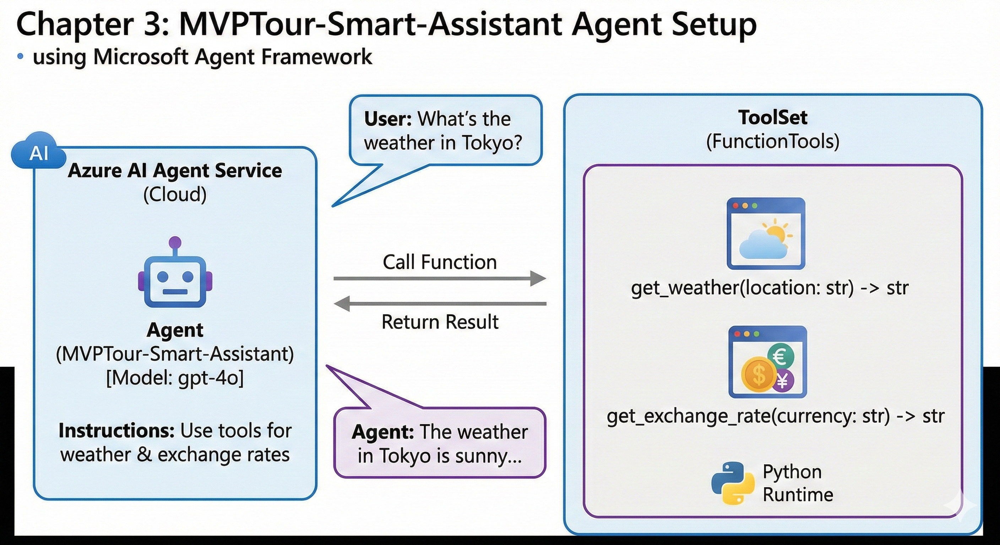

## **Chapter 3. 도구(Tools)를 장착한 스마트 상담원 'MVPTour'**

기본적인 대화만 가능했던 상담원에게 **날씨 조회**와 **환율 계산** 능력을 부여합니다. `agent_framework`의 `@tool` 데코레이터를 사용하면 파이썬 함수를 에이전트의 강력한 무기로 변신시킬 수 있습니다.

<br>
---

### **1. 사전 준비: 추가 라이브러리 확인**

도구의 입력값 검증을 위해 `pydantic`이 필요합니다. (대부분의 에이전트 프레임워크 설치 시 함께 설치됩니다.)

```bash
# 필요한 경우 설치
pip install pydantic

```

---

### **2. 단계별 코드 작성**

`03_mvp_agent_with_tools.py` 파일을 생성하고 진행합니다.

#### **Step 1: 에이전트가 사용할 '도구(함수)' 정의**

`@tool` 데코레이터를 사용하여 일반 파이썬 함수를 에이전트가 이해할 수 있는 도구로 만듭니다. 이때 **함수의 설명(Docstring)**과 **매개변수 설명(Field)**이 매우 중요합니다. 에이전트는 이 설명을 보고 어떤 상황에 이 도구를 쓸지 판단하기 때문입니다.

```python
from typing import Annotated
from pydantic import Field
from agent_framework import tool
from random import randint

# [도구 1] 날씨 조회 함수
@tool(approval_mode="never_require")
def get_weather(
    location: Annotated[str, Field(description="날씨를 확인하려는 도시 또는 지역명")]
) -> str:
    """지정된 지역의 현재 날씨 정보를 가져옵니다."""
    conditions = ["맑음", "흐림", "비", "폭풍우"]
    print(f"🔍 [시스템] 날씨 도구 호출 중: {location}") # 호출 확인용
    return f"{location}의 날씨는 {conditions[randint(0, 3)]}이며, 기온은 {randint(10, 30)}°C입니다."

# [도구 2] 환율 조회 함수
@tool(approval_mode="never_require")
def get_exchange_rate(
    base_currency: Annotated[str, Field(description="기준 통화 코드 (예: USD, EUR)")],
    target_currency: Annotated[str, Field(description="대상 통화 코드 (예: KRW, JPY)")]
) -> str:
    """두 통화 간의 실시간 환율 정보를 가져옵니다."""
    print(f"🔍 [시스템] 환율 도구 호출 중: {base_currency} -> {target_currency}")
    
    if target_currency == "KRW":
        rate = randint(130000, 145000) / 100
    else:
        rate = randint(80, 150) / 100
        
    return f"현재 {base_currency} 대비 {target_currency}의 환율은 {rate}입니다."

```

#### **Step 2: 에이전트에 도구 등록**

`as_agent`를 호출할 때 `tools` 리스트에 위에서 만든 함수들을 넣어줍니다.

```python
# ... (클라이언트 설정 생략) ...

agent = client.as_agent(
    instructions="""
    당신은 여행사 'MVPTour'의 상담원입니다. 
    고객에게 정중하게 인사하고, 여행 계획에 대해 도움을 줄 준비가 되었음을 알리세요.
    날씨나 환율 정보를 물어보면 제공된 도구를 사용하여 정확한 정보를 안내하세요.
    답변 끝에는 항상 '즐거운 여행의 시작, MVPTour입니다!'라는 문구를 붙여주세요.
    """,
    name="MVPTour-Assistant",
    tools=[get_weather, get_exchange_rate] # 작성한 도구들을 연결!
)

```

#### **Step 3: 실행 및 테스트**

에이전트에게 환율을 물어보고, 내부적으로 도구가 실행되는지 확인합니다.

```python
async def main():
    print(f"✅ 도구가 장착된 '{agent.name}'가 준비되었습니다.")

    # 테스트 입력
    user_input = "지금 원화 대비 달러의 환율은 어떤가요?"
    print(f"\n[나]: {user_input}")
    
    # 에이전트 실행 (도구가 필요하다고 판단되면 자동으로 함수를 실행합니다)
    result = await agent.run(user_input)
    print(f"\n[MVPTour 상담원]: {result}")

if __name__ == "__main__":
    asyncio.run(main())

```

---

### **💡 핵심 포인트 정리**

1. **@tool 데코레이터:** 단순한 함수를 에이전트가 다룰 수 있는 '기술'로 변환합니다. `approval_mode="never_require"`는 사용자 승인 없이 즉시 실행하도록 설정하는 옵션입니다.
2. **의미적 호출(Semantic Calling):** 사용자가 "환율 알려줘"라고 하면, 에이전트는 등록된 도구 중 `get_exchange_rate`가 적합하다는 것을 '설명'을 통해 판단하고 스스로 매개변수(USD, KRW 등)를 추출하여 함수를 호출합니다.
3. **Pydantic & Annotated:** 에이전트가 함수에 어떤 인자값을 넣어야 할지 명확하게 가이드 역할을 합니다.
4. **확장성:** 이제 이 에이전트는 API 호출, 데이터베이스 조회 등 파이썬으로 할 수 있는 모든 작업을 수행할 수 있게 되었습니다.

---
