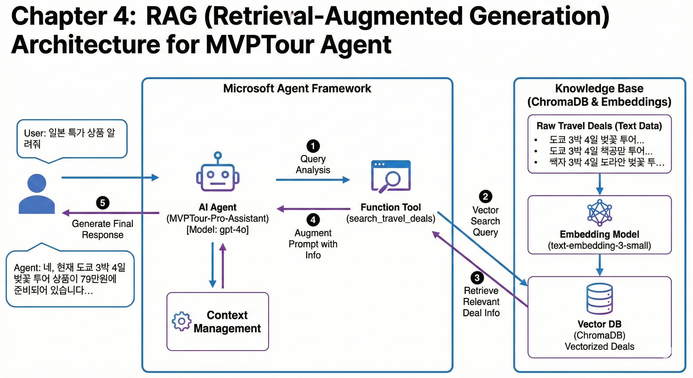

## **Chapter 4. ChromaDB를 활용한 RAG(지식 검색) 상담원 구현**

LLM은 전 세계의 일반적인 지식은 잘 알지만, 'MVPTour'만의 특별 패키지 구성이나 환불 정책은 알지 못합니다. 본 장에서는 **Vector DB(ChromaDB)**를 구축하고, 에이전트가 필요할 때마다 이 데이터베이스를 뒤져서 정확한 답변을 내놓는 과정을 실습합니다.


<br>
---

### **1. 사전 준비: 라이브러리 설치**

데이터를 벡터화하고 저장하기 위한 가벼운 Vector DB인 `chromadb`를 설치합니다.

```bash
# 터미널(Terminal)에 입력
pip install chromadb

```

---

### **2. 단계별 코드 작성**

`04_mvp_agent_rag.py` 파일을 생성하고 아래 단계에 따라 코드를 완성해 보세요.

#### **Step 1: 사내 지식 베이스(ChromaDB) 구축**

메모리 기반의 임시 데이터베이스를 만들고, 상담원이 참고할 데이터를 미리 넣어둡니다.

```python
import chromadb

# 1. ChromaDB 클라이언트 설정 (메모리 모드)
chroma_client = chromadb.Client()
collection = chroma_client.get_or_create_collection(name="mvp_tour_info")

# 2. 테스트용 사내 지식 데이터 추가
collection.add(
    documents=[
        "시애틀 투어 패키지: 3박 4일 일정으로 스페이스 니들 입장권이 포함되어 있습니다.",
        "MVPTour 특별 환전 서비스: 본사 1층에서 오전 9시부터 오후 4시까지 우대 환율을 제공합니다.",
        "예약 취소 규정: 여행 7일 전까지는 100% 환불 가능하며, 이후에는 50% 수수료가 발생합니다."
    ],
    ids=["doc1", "doc2", "doc3"]
)
print("📦 사내 지식 베이스 구축 완료!")

```

#### **Step 2: RAG 전용 도구(Tool) 정의**

사용자의 질문에서 키워드를 뽑아 DB를 검색하는 함수를 만듭니다.

```python
@tool(approval_mode="never_require")
def search_travel_docs(
    query: Annotated[str, Field(description="여행 상품이나 회사 규정에 대해 검색할 키워드")]
) -> str:
    """사내 지식베이스(ChromaDB)에서 여행 상품 및 정책 정보를 검색합니다."""
    print(f"🔍 [RAG] 지식베이스 검색 중: '{query}'")
    
    # 유사도 기반 검색 수행 (가장 관련 있는 데이터 1건 추출)
    results = collection.query(query_texts=[query], n_results=1)
    
    if results['documents'][0]:
        return f"관련 정보 검색 결과: {results['documents'][0][0]}"
    else:
        return "관련된 정보를 찾을 수 없습니다."

```

#### **Step 3: 에이전트 설정 및 세션 관리**

이제 에이전트는 날씨, 환율뿐만 아니라 사내 문서까지 검색할 수 있는 3종 도구 세트를 갖게 됩니다. 또한, `session`을 사용하여 대화의 맥락을 유지합니다.

```python
# 에이전트 생성 (기존 도구 + RAG 도구 추가)
agent = client.as_agent(
    instructions="""
    당신은 여행사 'MVPTour'의 상담원입니다. 
    날씨, 환율뿐만 아니라 사내 상품 정보나 규정에 대해서도 'search_travel_docs'를 통해 답변하세요.
    항상 '즐거운 여행의 시작, MVPTour입니다!'로 끝맺음하세요.
    """,
    name="MVPTour-Assistant",
    tools=[get_weather, get_exchange_rate, search_travel_docs]
)

async def main():
    print(f"✅ 멀티 능력을 갖춘 '{agent.name}'가 준비되었습니다.")
    
    # 3. 세션 생성 (대화 맥락 유지)
    session = agent.create_session()

    # 테스트 1: 외부 도구(날씨) 호출
    user_input = "시애틀 날씨 알려주세요."
    result = await agent.run(user_input, session=session)
    print(f"Agent: {result}\n")
    
    # 테스트 2: 내부 지식(RAG) 호출 - 상품 정보
    user_input = "시애틀 투어 패키지 구성은 어떻게 되나요?"
    result = await agent.run(user_input, session=session)
    print(f"Agent: {result}\n")

    # 테스트 3: 내부 지식(RAG) 호출 - 규정 확인
    user_input = "여행을 취소하면 환불을 얼마나 받을 수 있나요?"
    result = await agent.run(user_input, session=session)
    print(f"Agent: {result}\n")

```

---

### **💡 핵심 포인트 정리**

1. **RAG (검색 증강 생성):** 에이전트가 "모르는 것은 모른다"고 하거나 환각(Hallucination)을 일으키는 대신, 신뢰할 수 있는 데이터베이스에서 정보를 찾아 답변의 정확도를 높이는 방식입니다.
2. **Vector DB (ChromaDB):** 텍스트를 숫자의 나열(Vector)로 저장하여, 질문과 가장 의미적으로 가까운 문장을 빠르게 찾아냅니다.
3. **Session(세션)의 역할:** `agent.create_session()`을 사용하면 사용자와의 대화 기록이 서버에 남게 되어, "아까 말한 그거 다시 설명해줘" 같은 대화가 가능해집니다.
4. **도구의 협업:** 에이전트는 상황에 따라 `get_weather`를 쓸지, `search_travel_docs`를 쓸지 스스로 유연하게 판단합니다.

---
