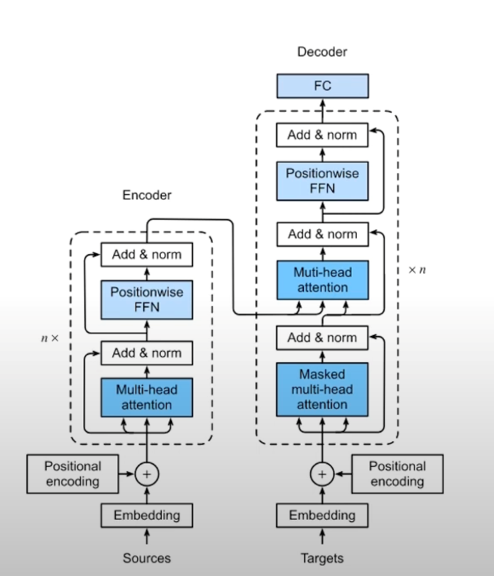
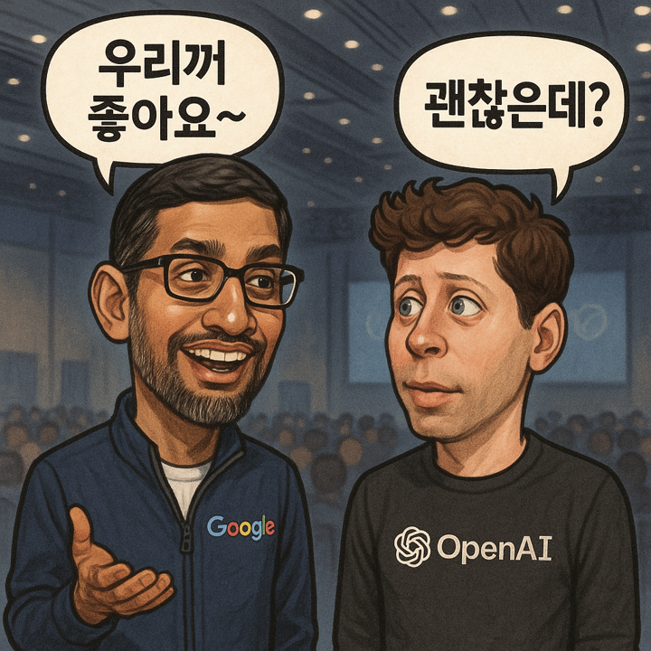
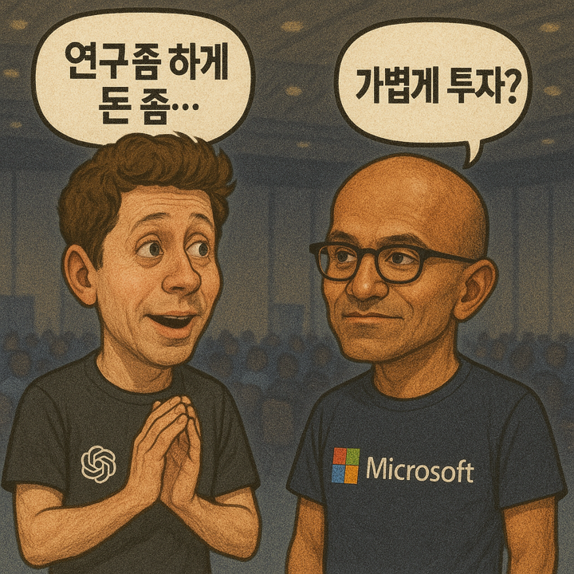
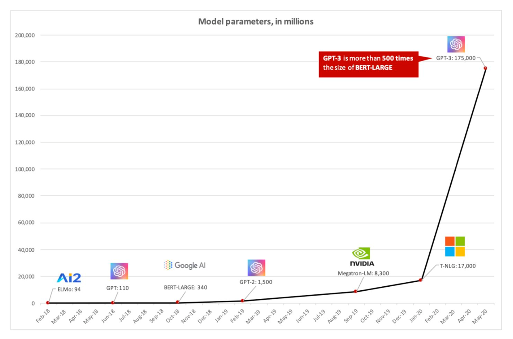

# OpenAI와 Microsoft

## 1) 한 줄 요약

Transformer는 **Self-Attention**으로 토큰들 간의 상호 의존성을 병렬로 학습하는 딥러닝 아키텍처입니다. RNN처럼 순차 계산에 묶이지 않아 **병렬화가 뛰어나고**, 긴 문맥을 **어텐션으로 직접 연결**해 언어·코드·비전까지 광범위하게 쓰입니다.

## 2) 큰 그림: 세 가지 계열

* **Encoder–Decoder (Seq2Seq)**: 입력을 인코더가 요약해 디코더가 출력 생성 (예: T5, 원래의 Transformer).
* **Encoder-only**: 입력 이해/분류·마스킹 복원 등 (예: BERT).
* **Decoder-only**: 다음 토큰 예측으로 생성 (예: GPT 계열, 대부분의 LLM).

## 3) 핵심 블록

**(a) 임베딩 & 위치 정보**

* 토큰을 벡터로 바꾸는 **Token/Positional Embedding**.
* 위치는 절대(사인/코사인, learned) 또는 **RoPE(회전 위치)**, **ALiBi** 등으로 부호화하여 길이 일반화/확장성 개선.

**(b) Scaled Dot-Product Attention (수식)**

$$
\text{Attention}(Q,K,V) = \mathrm{softmax}\!\left(\frac{QK^\top}{\sqrt{d_k}} + M\right)V
$$

* $Q$=쿼리, $K$=키, $V$=값, $d_k$=키 차원.
* $M$=마스크(미래 토큰 가리기, 패딩 무시 등).

**(c) Multi-Head Attention**

* 서로 다른 서브공간에서 병렬 어텐션(head)을 수행 후 concat → 선형변환.
* 다양한 관계(동의어, 문법, 장거리 의존)를 **동시에 포착**.

**(d) Position-wise FFN**

* 각 토큰에 독립 적용되는 2\~3층 MLP(예: GELU), 차원 확장(예: 4×) 후 축소.

**(e) 잔차 연결 & LayerNorm**

* **Residual**로 기울기 흐름을 안정화, **(Pre-)LayerNorm**으로 학습 안정성 확보.
* Dropout/정규화로 과적합 방지.

## 4) 어텐션 종류와 마스킹

* **Self-Attention**: 같은 시퀀스 내 토큰들이 서로 주목 (인코더·디코더 둘 다).
* **Cross-Attention**: 디코더가 인코더 출력에 주목(Encoder–Decoder형).
* **Causal/Masked Self-Attention**: 미래 토큰을 가리는 상삼각 마스크(생성 모델 필수).

## 5) 학습 목표(Objectives)

* **Autoregressive (LM)**: $p(x_t|x_{<t})$ 최대화(다음 토큰 예측). GPT·대부분 LLM.
* **Masked LM (MLM)**: 일부 토큰 가리고 복원(BERT).
* **Seq2Seq**: 입력→출력 조건부 생성(T5/번역).
* **Instruction/Preference Tuning**: SFT, DPO 등으로 사람 지시·선호에 맞춤.

## 6) 추론(생성) 메커니즘

* **디코딩**: Greedy, Beam Search(정확·보수적), **Sampling**(Top-k/Top-p, Temperature; 다양성).
* **KV Cache**: 이전 스텝의 $K,V$를 캐싱해 매 스텝 O(L) 재계산을 피함(지연 감소, 메모리는 증가).
* **길이 일반화**: RoPE/ALiBi, **슬라이딩·블록 어텐션**, **긴 컨텍스트 최적화(FlashAttention, 근사 어텐션)**.

## 7) 계산 복잡도와 최적화

* 기본 **Self-Attention 비용: O(L²·d)**, 메모리도 L².
* **FlashAttention**(타일링/온칩), **Paginated/KV 압축**, **선택적/국소 어텐션**, **저차원 근사**로 가속.
* 학습: **Mixed Precision**, **Gradient Checkpointing**, **ZeRO/파이프라인 병렬**, \*\*MoE(전문가 라우팅)\*\*로 확장.

## 8) 대표 변종·적용

* **BERT(Encoder-only)**: 이해/분류/검색, MLM 사전학습.
* **GPT(Decoder-only)**: 텍스트·코드 생성, 도구 사용, 다중턴.
* **T5(Encoder–Decoder)**: “text-to-text” 통합 프레임.
* **ViT/멀티모달**: 이미지를 패치 토큰으로 변환해 Transformer에 투입.
* **그 외**: Longformer, Performer, Reformer(효율형), LLaMA/PaLM/Mixtral(MoE) 등.

## 9) 왜 잘 작동하나?

* **병렬화**: RNN 대비 학습 속도 우수.
* **명시적 장거리 의존 처리**: 필요한 위치에 직접 주의(attend).
* **스케일 법칙**: 모델·데이터·연산이 커질수록 성능이 규칙적으로 향상.

## 10) 한계와 주의점

* **L² 비용**: 매우 긴 컨텍스트에서 비싸며, 메모리 병목.
* **환각(Hallucination)**: 사실성 보장을 위해 **RAG/툴 사용/검증** 필요.
* **데이터 편향·보안**: 프롬프트 주입, 정보 누출 등 안전 대책 필요.
* **길이 외삽**: 훈련 길이 밖의 일반화는 위치 기법·훈련 레시피에 민감.

## 11) 실무 팁(요약)

* 긴 문맥: **RoPE+정교한 스케일링**, FlashAttention, 슬라이딩/블록 어텐션.
* 파인튜닝: **LoRA/QLoRA**, 적절한 학습률 스케줄·정규화.
* 디코딩 품질: **Top-p 0.8\~0.95 + 온도 0.7±**, 작업 성격에 맞춰 조정.
* 효율: **KV 캐시 관리**, 4/8비트 양자화(지연·메모리 절감) 검토.

---

아래는 **OpenAI 회사 개요**, **Microsoft의 투자 내역과 그 결과**, 그리고 \*\*환율(1,300 ₩/US\$ 기준으로 환산한 금액)\*\*을 정리한 내용입니다.

---

## 12. OpenAI란 어떤 회사인가?

* **OpenAI**는 **2015년 설립된 미국 샌프란시스코 기반의 인공지능 연구·배포 기업**으로, 본래는 비영리 조직으로 출발했으며 창립자에는 Sam Altman, Elon Musk, Ilya Sutskever, Greg Brockman 등이 포함됩니다.([semafor.com][1], [Encyclopedia Britannica][2])
* 본래 “인공지능이 모든 인류에게 혜택되도록 한다”는 비전 아래 비영리 모델로 운영되었고, 초기 자금으로 약 10억 달러의 헌금 약속이 있었습니다.([Encyclopedia Britannica][2], [Tech Monitor][3])
* 이후에는 **비영리(OpenAI, Inc.)와 영리 자회사(OpenAI Global LLC)** 체제로 전환하여, 상업화를 통해 연구도 지속하고 있습니다.([Encyclopedia Britannica][2])

---

## 13. Microsoft가 OpenAI에 어떻게 투자했을까?

* **2019년**: Microsoft가 **10억 달러를 투자**, 이 중 약 절반은 Azure 사용 크레딧 형태였으며, 이를 통해 OpenAI는 **Azure를 독점 클라우드 공급자로 사용하게 됐습니다**.([TechCrunch][4])
* **2023년**: Microsoft는 **추가로 약 100억 달러 규모의 다년간 투자를 발표**했고, 이로써 **총 약 130억 달러 이상**을 투자하게 됐습니다.([techovedas][5])
* 영국 경쟁 당국도 이 **130억 달러 규모 투자를 승인**, Microsoft가 OpenAI를 완전히 통제하지 않는다는 점을 강조했습니다.([Financial Times][6])

---

## 14. Microsoft는 투자로 무엇을 얻었나?

1. **Azure 기반 독점 공급업체 권한**
   OpenAI의 모델들이 **Azure 클라우드 인프라 위에서 작동**하게 되어, Microsoft는 그 과금 및 운영 수익을 가져갑니다.([위키백과][7])

2. **제품 및 서비스의 AI 강화**

   * **Microsoft 365 Copilot**, **Azure OpenAI Service**, **Bing**, **Edge** 등 제품에 OpenAI 기술이 통합됨([Fool][8])
   * 수많은 포춘 500 기업들이 Copilot을 도입하는 등 **광범위한 기업 고객기반** 확보([Fool][8])

3. **이익 배분 구조**

   * OpenAI 수익 일부(예: 초기 이익 일부 사용 후, 그다음 이익의 75%를 Microsoft에게 제공 등)([techovedas][5])
   * 최종적으로 **OpenAI 이익의 최대 49%까지** 해당되는 조건을 제시했다는 보도도 있습니다.([investcrystal.com][9])

4. **지분과 영향력**

   * OpenAI의 일부 수익 및 전략적 방향에 영향력을 행사할 수 있다는 점에서 **전략적 파트너십이 아닌 실질적 투자자 관계**라는 해석도 있습니다.([Business Insider][10], [Financial Times][6])
   * 다만, Microsoft가 **지배적 통제권을 행사하지는 않는다고 규제기관이 판단**했습니다.([Financial Times][6])

---

## 15. 환율(1,300 ₩/US\$ 기준)로 환산

| 항목          | 달러 금액                    | 원화 환산 (약)        |
| ----------- | ------------------------ | ---------------- |
| 2019년 초기 투자 | \$1 B                    | ₩1.3조            |
| 2023년 추가 투자 | \$10 B                   | ₩13.0조           |
| 총 투자        | \$13 B 이상 (최대 \$13.75 B) | ₩16.9조 \~ ₩17.9조 |

* \$1 B → **₩1.3조**
* \$10 B → **₩13조**
* \$13 B → **₩16.9조**,
* \$13.75 B → **₩17.875조**

---

### 요약

* **OpenAI**는 “인류 공익 목적”으로 출발한 AI 연구 기업이며, 현재는 일부 영리 활동도 병행하고 있습니다.
* **Microsoft는** 2019년 초기 \$1 B, 2023년 추가 \$10 B 등 총 약 \$13–13.75 B를 투자했습니다.
* 그 **대가**로 Azure 공급 독점, 제품에 AI 통합, 수익 배분, 전략적 영향력을 확보했습니다.
* **환산 시**, 이 투자는 대략 **₩17조 내외**에 해당합니다.

[1]: https://www.semafor.com/article/11/18/2023/openai-has-received-just-a-fraction-of-microsofts-10-billion-investment?utm_source=chatgpt.com "OpenAI has received just a fraction of Microsoft’s $10 billion investment - Semafor"
[2]: https://www.britannica.com/money/OpenAI?utm_source=chatgpt.com "OpenAI | ChatGPT, Sam Altman, Microsoft, & History | Britannica Money"
[3]: https://www.techmonitor.ai/what-is/what-is-openai?utm_source=chatgpt.com "What is OpenAI? - Tech Monitor"
[4]: https://techcrunch.com/2023/01/23/microsoft-invests-billions-more-dollars-in-openai-extends-partnership/?utm_source=chatgpt.com "Microsoft invests billions more dollars in OpenAI, extends partnership - TechCrunch"
[5]: https://techovedas.com/microsofts-13-75-billion-investment-drives-openai-157-billion-valuation-surge-and-restructuring/?utm_source=chatgpt.com "Microsoft’s $13.75 Billion Investment Drives OpenAI $157 Billion Valuation Surge and ..."
[6]: https://www.ft.com/content/8f7fcaaf-2ae0-4c2f-a016-6f51d2f83cba?utm_source=chatgpt.com "Microsoft's $13bn OpenAI tie-up cleared by UK competition regulator"
[7]: https://en.wikipedia.org/wiki/Products_and_applications_of_OpenAI?utm_source=chatgpt.com "Products and applications of OpenAI"
[8]: https://www.fool.com/investing/2024/11/10/microsoft-13-billion-openai-best-money-ever-spent/?utm_source=chatgpt.com "Microsoft's $13 Billion Investment in OpenAI May Be \"Some of the Best Money Ever Spent ..."
[9]: https://www.investcrystal.com/microsoft-openai-investment?utm_source=chatgpt.com "How Much Did Microsoft Invest in OpenAI, and Why Should You Care?"
[10]: https://www.businessinsider.com/openai-2-year-lead-ai-race-chatgpt-microsoft-satya-nadella-2024-12?utm_source=chatgpt.com "OpenAI had a 2-year lead in the AI race to work 'uncontested,' Microsoft CEO Satya Nadella says"
