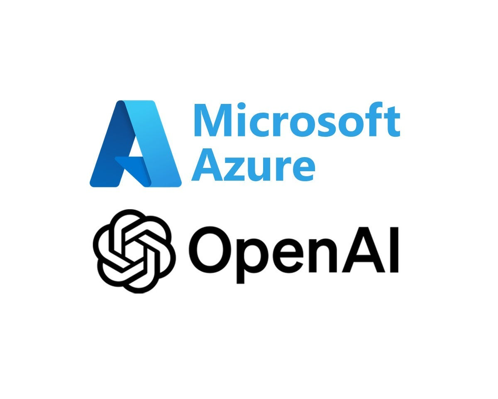

# Azure OpenAI Service

## 🔹 1. 개요 (Overview)

* **Azure OpenAI Service**는 Microsoft Azure 클라우드 상에서 \*\*OpenAI의 대규모 언어 모델(LLM)\*\*과 기타 생성형 AI 모델을 **보안·확장성·기업 환경에 맞춰 제공하는 서비스**입니다.
* OpenAI의 **GPT (GPT-3.5, GPT-4, GPT-4o 등)**, **Codex**, **DALL·E**, **Embeddings 모델**을 API 형태로 사용 가능.
* Microsoft는 **Azure의 보안·컴플라이언스·네트워크 인프라**와 결합하여 기업 고객이 **생성형 AI를 안전하게 활용**할 수 있도록 제공.

## 🔹 2. 주요 기능 (Key Features)

1. **텍스트 생성 (GPT 계열)**

   * 자연어 질의응답, 요약, 번역, 문서 작성, 대화형 챗봇 등.
2. **코드 생성 (Codex, GPT-4 Turbo with Code)**

   * 자연어를 코드로 변환, 자동 완성, 코드 리뷰 등 개발 보조.
3. **이미지 생성 (DALL·E)**

   * 텍스트 프롬프트를 기반으로 한 이미지 생성·편집.
4. **임베딩 (Embeddings)**

   * 텍스트를 벡터화하여 검색, 추천, 분류, 의미 기반 검색에 활용.
5. **Enterprise Integration**

   * Azure의 **ID 관리(Azure AD), 네트워크 격리(VNET), 프라이빗 엔드포인트**와 연동.
   * SOC, GDPR, HIPAA 등 **보안·규제 준수** 지원.

## 🔹 3. 장점 (Advantages for Enterprises)

* **보안 강화**

  * 기업 데이터는 기본적으로 OpenAI 학습에 사용되지 않음.
  * Azure 내 **프라이빗 네트워크 배치** 가능.
* **확장성**

  * Azure 글로벌 데이터센터 인프라 활용 → 수백만 요청 처리 가능.
* **통합성**

  * **Power Platform**, **Dynamics 365**, **Microsoft 365 Copilot** 등과 직접 연결 가능.
* **비용 관리**

  * 사용량 기반 과금(Pay-as-you-go), 특정 모델·리소스 단위로 제어.

## 🔹 4. 대표 활용 사례 (Use Cases)

1. **고객 지원**

   * 챗봇, FAQ 자동 응답, 다국어 지원.
2. **문서 요약·분석**

   * 수천 페이지 보고서 자동 요약, 법률/의료 문서 분석.
3. **지식 검색 (RAG: Retrieval-Augmented Generation)**

   * 사내 데이터와 결합하여 정확한 답변 제공.
4. **개발자 지원**

   * 코드 자동 생성·변환·테스트 케이스 생성.
5. **창작 업무**

   * 마케팅 카피, 블로그 콘텐츠, 이미지 생성.

## 🔹 5. Microsoft와 OpenAI의 시너지

* **OpenAI 모델 제공자**: GPT, DALL·E 등 최신 모델 개발.
* **Microsoft**: Azure 클라우드를 통한 배포, 엔터프라이즈 기능(보안·확장성·통합성) 제공.
  ➡️ 결과적으로 **기업 고객은 최신 생성형 AI 모델을 안전하고 확장성 있게 사용**할 수 있음.

---

## 🔹 6. 가격 체계 (요약)

* 모델별 **1,000 토큰 단위 과금** (예: GPT-4, GPT-3.5 Turbo 등).
* Embedding 모델은 **1,000 토큰당 저렴한 비용**.
* DALL·E는 **이미지 크기/수량 기반 과금**.
  (※ 실제 요금은 지역·리소스별로 다르며, Microsoft 공식 [가격표](https://azure.microsoft.com/pricing/details/cognitive-services/openai-service/) 참고 필요)

---

## 🔹 7. 정리

**Azure OpenAI Service = OpenAI 모델 + Microsoft Azure 보안·확장성 패키지**

* OpenAI 모델을 직접 쓰는 것보다 **더 안전하고 기업 맞춤형**.
* **Copilot, Bing, Dynamics** 등 Microsoft의 다양한 서비스에도 기반 기술로 사용됨.
* 기업 입장에서 **보안 + 규제 준수 + 확장성** 확보가 가장 큰 가치.