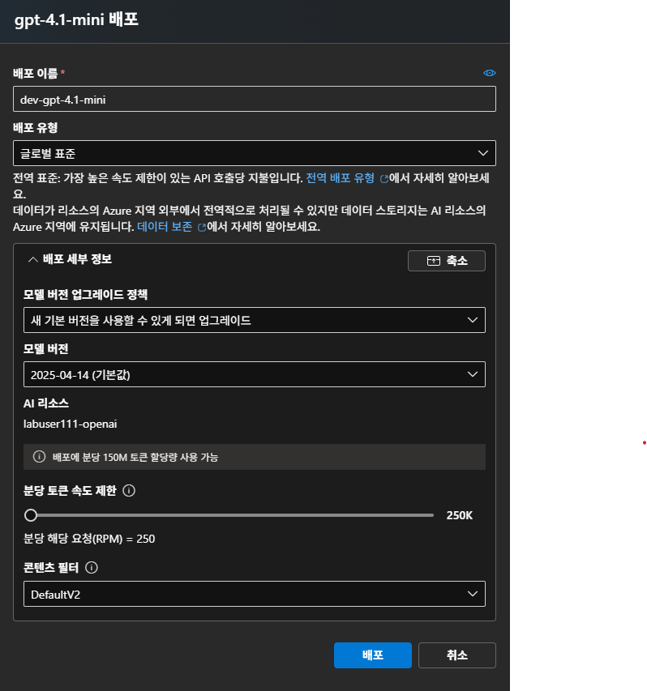

# Azure OpenAI에서 모델을 배포(deploy)하는 방법

## 1) 배포까지의 전체 흐름(요약)

1. **리소스 생성:** Azure Portal → *Azure OpenAI* 리소스 만들기(구독/리전/네트워킹 선택). ([Microsoft Learn][1])
2. **모델 선택 & 배포:** Azure \*\*AI Foundry 포털(Model catalog)\*\*에서 모델(GPT-4o/4.1/5 등) 선택 → *Deploy* → 배포 타입/버전/이름/쿼터 설정. ([Microsoft Learn][2])
3. **인증 설정:** API Key 또는 **Microsoft Entra ID**(Bearer 토큰). ([Microsoft Learn][3])
4. **쿼터/스케일링 설정:** TPM/RPM 한도(표준) 또는 **PTU(Provisioned Throughput Unit)** 예약(예측 가능한 대량 트래픽). ([Microsoft Learn][4])
5. **콘텐츠 안전 & 거버넌스:** **콘텐츠 필터** 연결/임계값 조정(필요 시 제한적 승인 절차)·남용 모니터링 정책 확인. ([Microsoft Learn][5])
6. **호출:** `https://{리소스명}.openai.azure.com/openai/deployments/{배포명}/...` 엔드포인트로 **Chat Completions** 또는 **Responses API** 호출. ([Microsoft Learn][3])

## 2) 배포 방법(포털/코드/템플릿)

### A. 포털(Azure AI Foundry)

* **Model catalog → Azure OpenAI**에서 모델 선택 → **Deploy**.
* **Deployment name**, **Model version**, **Deployment type(아래 3장)**, **Quota(표준 TPM/RPM 또는 PTU)**, **Content filter** 연결을 지정합니다. ([Microsoft Learn][2])

### B. API/SDK

* **Chat Completions**(GA) 또는 **Responses API**(프리뷰, 멀티모달·상태저장) 중 선택. ([Microsoft Learn][3])
* 예: `POST .../deployments/{배포명}/chat/completions?api-version=2024-10-21` (GA 스펙) 또는 v1 **preview**(Responses). ([Microsoft Learn][3])

### C. CLI/템플릿 자동화

* **Azure CLI:** `az cognitiveservices account deployment ...`로 배포 리소스 생성/조회/삭제. ([Microsoft Learn][6])
* **ARM/Bicep:** `Microsoft.CognitiveServices/accounts/deployments` 리소스 타입으로 IaC 구성. ([Microsoft Learn][7])

## 3) 배포 “타입”과 선택 기준

| 구분                     | 목적/특징                                                     | 언제 쓰나                                                |
| ---------------------- | --------------------------------------------------------- | ---------------------------------------------------- |
| **Standard**           | Pay-as-you-go. 리소스에 **TPM/RPM 쿼터** 배분.                    | 소규모\~중간 규모, 탄력적 워크로드. ([Microsoft Learn][4])         |
| **Provisioned (PTU)**  | **전용 처리량(PTU)** 예약. 지연·변동성 ↓, 예측 가능한 대량 트래픽.              | 대규모·안정적 트래픽, SLA·성능 예측 중요할 때. ([Microsoft Learn][8]) |
| **Batch**              | 비동기 대량 처리. **Global/Data Zone Batch** 옵션, 24h 처리 목표·별도 큐. | 야간 일괄 요약/임베딩 대량 생성. ([Microsoft Learn][9])           |
| **Developer(미세튜닝 전용)** | 파인튜닝 모델 배포 전용(데브 티어).                                     | 커스텀 모델 검증/평가. ([Microsoft Learn][10])                |

> **글로벌/데이터존/지리(Azure 지역)**
> 각 타입은 **Global / Data Zone / Azure geography(지역)** 옵션으로 나뉘며, **Global**은 전세계 인프라로 라우팅해 높은 초기 쿼터를 제공, **Data Zone**은 특정 권역(EU/US 등) 내 다중 리전에 스팬, **지역**은 지정 리전에 고정됩니다. 고정된 지연·데이터 경계가 중요하면 Data Zone/지역을, 최고 처리량이 중요하면 Global을 고려하세요. ([Microsoft Learn][11], [GitHub][12])

## 4) 모델·버전·API 옵션

* **모델/버전 선택**: 사용 가능한 모델·버전은 리전마다 다릅니다(예: GPT-4o, 4.1, 5 시리즈 등). 배포 후 \*\*업그레이드 정책(자동/수동)\*\*과 **리타이어 날짜**를 포털에서 확인·변경할 수 있습니다. ([Microsoft Learn][13])
* **API 선택**

  * **Chat Completions(GA)**: 대화형 텍스트 작업의 표준. ([Microsoft Learn][14])
  * **Responses API(Preview)**: 멀티모달·상태저장·툴 호출 등 **Assistants+Chat** 통합형. 최신 기능 사용 시 권장. ([Microsoft Learn][15])

## 5) 스케일/쿼터 옵션

* **표준(Standard)**: 배포별 **TPM(토큰/분), RPM(요청/분)** 한도를 설정/분배합니다(동적 할당 가능). ([Microsoft Learn][4])
* **PTU(Provisioned)**: 작업의 예상 **TPM**을 기반으로 **PTU 개수**를 산정해 예약합니다(용량 계산기/가이드 제공). 429 처리 기준과 청구 모델은 PTU 문서 참고. ([Microsoft Learn][8])

## 6) 보안·거버넌스 옵션

* **인증**: API Key 또는 **Entra ID**(권장). 엔드포인트/리소스별 RBAC로 권한을 분리(예: *Cognitive Services OpenAI Contributor*에게 배포 권한). ([Microsoft Learn][3])
* **네트워크 격리**: VNet/프라이빗 엔드포인트·방화벽 규칙과 함께 “On Your Data” 구성 시 접근제어 가이드 제공. ([Microsoft Learn][16])
* **콘텐츠 필터 & 남용 모니터링**: 기본 필터를 배포에 연결·임계값 조정 가능(특정 완화/해제는 **Limited Access** 승인 필요). ([Microsoft Learn][5])
* **데이터 처리/보존**: Responses/Batch/파인튜닝 등 기능별 데이터 처리 방식과 로그·보존정책은 개인정보 문서에서 확인. ([Microsoft Learn][17])

## 7) 실전 체크리스트(권장 설정)

* **배포 타입**: 실시간 고트래픽 → *Global Standard* 또는 **PTU** / 지역 거버넌스 요구 → *Data Zone* 또는 *지역(Geography)*. ([Microsoft Learn][11])
* **버전 전략**: 운영은 “수동 업그레이드 + 사전 테스트”로 안정성 확보, 리타이어 캘린더 모니터링. ([Microsoft Learn][18])
* **API**: 기존 앱 호환성→Chat Completions, **멀티모달·툴** 중심 신규 앱→**Responses**. ([Microsoft Learn][3])
* **쿼터/스케일**: 성장 예측 시 **동적 쿼터** 또는 **PTU**로 버스트·안정성 모두 대비. ([Microsoft Learn][19])
* **거버넌스**: 필터 정책과 역할/RBAC, 네트워크 격리, 로그/보존 요구사항을 초기 설계에 반영. ([Microsoft Learn][20])

[1]: https://learn.microsoft.com/en-us/azure/ai-foundry/openai/how-to/create-resource?utm_source=chatgpt.com "How-to: Create and deploy an Azure OpenAI in Azure AI Foundry Models resource - Azure ..."
[2]: https://learn.microsoft.com/en-us/azure/ai-foundry/how-to/deploy-models-openai?utm_source=chatgpt.com "How to deploy Azure OpenAI models with Azure AI Foundry"
[3]: https://learn.microsoft.com/en-us/azure/ai-foundry/openai/reference?utm_source=chatgpt.com "Azure OpenAI in Azure AI Foundry Models REST API reference"
[4]: https://learn.microsoft.com/en-us/azure/ai-foundry/openai/quotas-limits?utm_source=chatgpt.com "Azure OpenAI in Azure AI Foundry Models Quotas and Limits"
[5]: https://learn.microsoft.com/en-us/azure/ai-foundry/openai/how-to/content-filters?utm_source=chatgpt.com "Configure content filters (preview) - Azure OpenAI"
[6]: https://learn.microsoft.com/ko-kr/cli/azure/cognitiveservices/account/deployment?view=azure-cli-latest&utm_source=chatgpt.com "az cognitiveservices account deployment | Microsoft Learn"
[7]: https://learn.microsoft.com/en-us/azure/templates/microsoft.cognitiveservices/accounts/deployments?utm_source=chatgpt.com "Microsoft.CognitiveServices/accounts/deployments - Bicep, ARM template & Terraform ..."
[8]: https://learn.microsoft.com/en-us/azure/ai-foundry/openai/how-to/provisioned-throughput-onboarding?utm_source=chatgpt.com "Understanding costs associated with provisioned throughput units (PTU)"
[9]: https://learn.microsoft.com/en-us/azure/ai-foundry/openai/how-to/batch?utm_source=chatgpt.com "Getting started with Azure OpenAI batch deployments"
[10]: https://learn.microsoft.com/ko-kr/azure/ai-foundry/openai/how-to/fine-tune-test?utm_source=chatgpt.com "Test a fine-tuned model - Azure OpenAI | Microsoft Learn"
[11]: https://learn.microsoft.com/en-us/azure/ai-foundry/openai/how-to/deployment-types?utm_source=chatgpt.com "Understanding Azure AI Foundry Models Deployment Types"
[12]: https://github.com/MicrosoftDocs/azure-ai-docs/blob/main/articles/ai-foundry/openai/how-to/deployment-types.md?utm_source=chatgpt.com "azure-ai-docs/articles/ai-foundry/openai/how-to/deployment-types.md at main ... - GitHub"
[13]: https://learn.microsoft.com/en-us/azure/ai-foundry/openai/concepts/models?utm_source=chatgpt.com "Azure OpenAI in Azure AI Foundry Models - Azure OpenAI"
[14]: https://learn.microsoft.com/en-us/azure/ai-foundry/openai/how-to/chatgpt?utm_source=chatgpt.com "Work with chat completion models - Azure OpenAI in Azure AI Foundry Models | Microsoft ..."
[15]: https://learn.microsoft.com/en-us/azure/ai-foundry/openai/how-to/responses?utm_source=chatgpt.com "Azure OpenAI Responses API - Azure OpenAI | Microsoft Learn"
[16]: https://learn.microsoft.com/en-us/azure/ai-foundry/openai/how-to/on-your-data-configuration?utm_source=chatgpt.com "Network and access configuration for Azure OpenAI On Your Data"
[17]: https://learn.microsoft.com/en-us/azure/ai-foundry/responsible-ai/openai/data-privacy?utm_source=chatgpt.com "Data, privacy, and security for Azure OpenAI Service"
[18]: https://learn.microsoft.com/ko-kr/azure/ai-foundry/openai/concepts/model-versions?view=azureml-api-2&utm_source=chatgpt.com "Azure OpenAI in Azure AI Foundry Models model versions"
[19]: https://learn.microsoft.com/en-us/azure/ai-foundry/openai/how-to/quota?utm_source=chatgpt.com "Manage Azure OpenAI in Azure AI Foundry Models quota"
[20]: https://learn.microsoft.com/en-us/azure/ai-foundry/openai/how-to/role-based-access-control?utm_source=chatgpt.com "Role-based access control for Azure OpenAI | Microsoft Learn"
