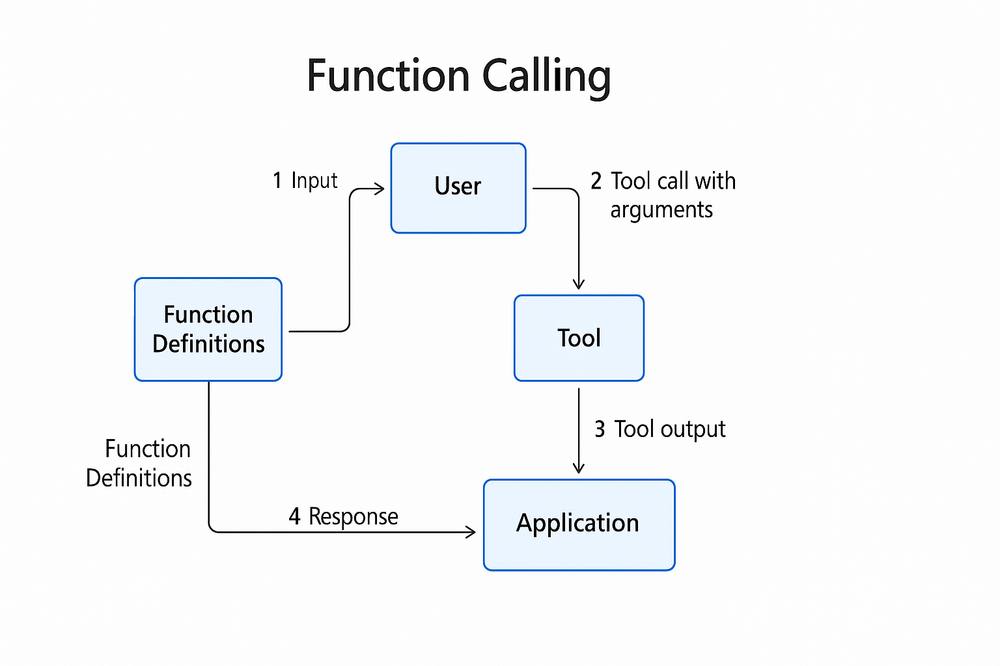

# 📌 Function Calling 개념

모델이 응답으로 자연어 텍스트 대신, 미리 정의된 함수의 이름과 인자(JSON 형태)를 반환할 수 있게 하는 기능입니다.



왜 필요할까?
모델이 “검색해줘, 계산해줘, 데이터베이스에서 꺼내줘” 같은 요청을 받았을 때, 그냥 텍스트 설명만 하는 게 아니라 개발자가 연결해둔 함수를 호출해 실제 동작을 수행할 수 있도록 하기 위함입니다.

## 📌 예제 시나리오

사용자가 "서울 날씨 알려줘"라고 물어보면 → 모델이 `get_weather` 함수를 호출 → 실제 함수가 실행 → 결과를 모델이 자연스럽게 응답.

## 📌 코드 예제 (Python)

```python
import os
from openai import AzureOpenAI

client = AzureOpenAI(
    api_version="2024-12-01-preview",
    azure_endpoint="https://labuser111-openai.openai.azure.com/",
    api_key=subscription_key,
)

# 함수 정의 (JSON Schema 방식)
functions = [
    {
        "name": "get_weather",
        "description": "Get the current weather in a given city",
        "parameters": {
            "type": "object",
            "properties": {
                "location": {
                    "type": "string",
                    "description": "The city and country, e.g. Seoul, South Korea"
                }
            },
            "required": ["location"]
        }
    }
]

# 실제 함수 (모델은 이걸 직접 실행하지 않음, 우리가 실행)
def get_weather(location: str):
    # 실제로는 외부 API 호출 (예: OpenWeather API) 넣으면 됨
    # 여기서는 샘플 데이터 리턴
    return {"location": location, "temperature": "28°C", "condition": "Sunny"}

# Step 1. 모델에 사용자 질문 전달
response = client.chat.completions.create(
    model="dev-gpt-4.1-mini",  # function calling 지원 모델
    messages=[{"role": "user", "content": "서울 날씨 알려줘"}],
    functions=functions,
    function_call="auto",  # 모델이 필요 시 함수 호출
)

# Step 2. 모델의 응답 확인
msg = response.choices[0].message

if msg.function_call:  # 함수 호출 요청이 있으면
    func_name = msg.function_call.name
    args = msg.function_call.arguments

    if func_name == "get_weather":
        # 실제 함수 실행
        import json
        args_dict = json.loads(args)
        result = get_weather(**args_dict)

        # Step 3. 함수 결과를 다시 모델에 전달
        second_response = client.chat.completions.create(
            model="dev-gpt-4.1-mini",
            messages=[
                {"role": "user", "content": "서울 날씨 알려줘"},
                msg,  # 모델이 보낸 function_call
                {"role": "function", "name": func_name, "content": str(result)},
            ],
        )

        print(second_response.choices[0].message.content)
```

## 📌 실행 흐름

1. 사용자가 `"서울 날씨 알려줘"` → 모델이 `"get_weather"` 함수 호출을 제안
2. Python 코드에서 실제 `get_weather()` 함수 실행
3. 결과를 모델에 다시 전달
4. 모델이 사람이 읽을 수 있게 응답 정리 → `"현재 서울의 날씨는 맑고, 28도입니다."`

즉, 모델은 **“무슨 함수를 어떻게 불러야 하는지”만 알려주고**,
**실제 실행은 개발자가 컨트롤**하는 방식이에요. 🔑
