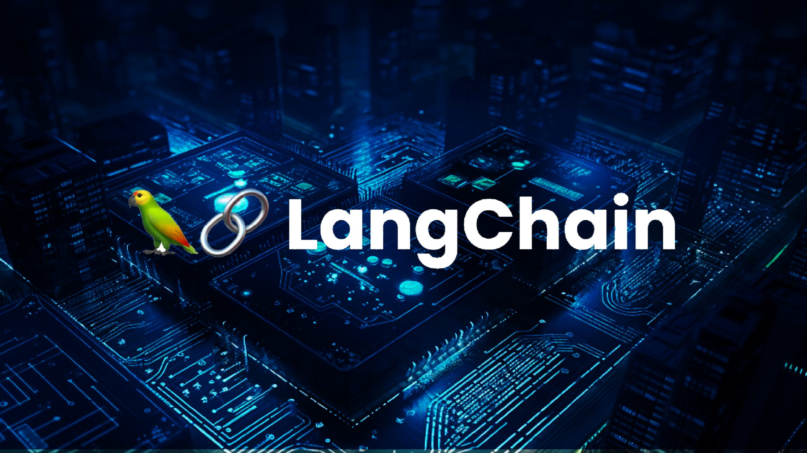
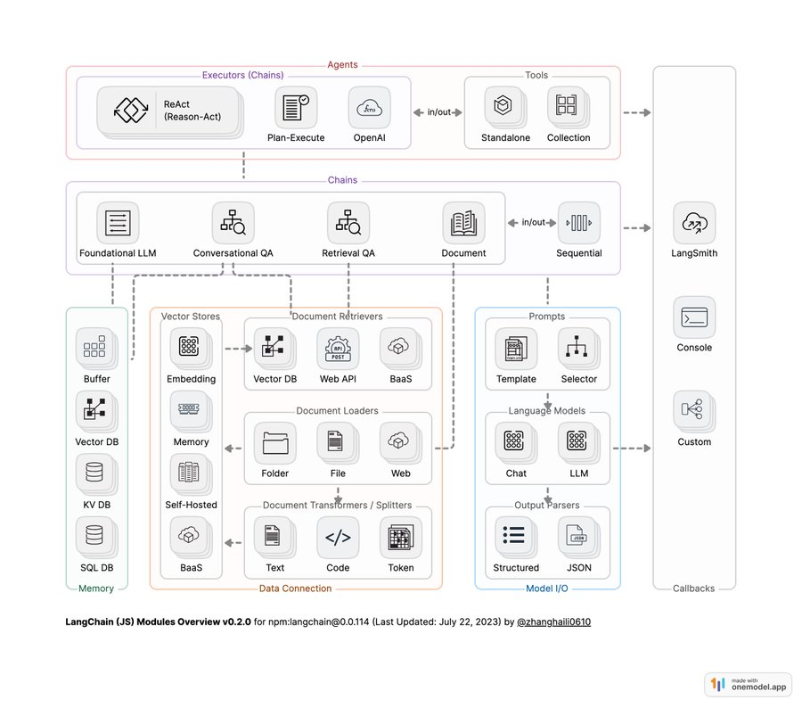

# 🔎 LangChain 정리

## 1. LangChain이란?

* **정의**: LangChain은 **LLM(대규모 언어 모델) 기반 애플리케이션을 쉽게 개발할 수 있도록 돕는 프레임워크**.
* **핵심 목적**: LLM을 단순 대화 엔진에서 확장해 **외부 데이터 연동, 도구 활용, 체인(workflow) 구성**을 가능하게 함.
* **비유**: “LLM을 두뇌라고 하면, LangChain은 그 뇌가 **외부 도구·데이터와 연결되어 일을 하도록 돕는 신경망** 역할.”

---

## 2. 왜 LangChain이 중요한가?

1. **LLM 단독 한계 극복**

   * LLM은 최신 데이터 접근 불가, 계산 불가, 휘발성 기억(Stateless) 문제 존재.
2. **개발 편의성**

   * 검색, 데이터베이스, API, Agent 등 자주 쓰는 기능을 모듈화하여 빠른 개발 가능.
3. **생성형 AI 서비스 표준**

   * 챗봇, RAG, Agent 개발 시 업계에서 가장 널리 쓰이는 라이브러리.

---

## 3. LangChain의 아키텍처

LangChain은 **LLM 활용 파이프라인을 구성하기 위한 구성요소**로 나눌 수 있음:

1. **LLMs (Large Language Models)**

   * GPT, Claude, LLaMA 등 모델과의 연결.

2. **Prompts**

   * 프롬프트 템플릿 제공 및 변수를 쉽게 관리.

3. **Memory**

   * 대화의 맥락(히스토리)을 저장하고 이어가기 가능.
   * 예: 챗봇이 이전 대화 기억.

4. **Chains**

   * 여러 단계를 묶어 하나의 흐름(Workflow)으로 구성.
   * 예: “사용자 질문 → 검색 → 요약 → 답변”.

5. **Agents**

   * LLM이 스스로 판단하여 도구(API, 계산기, DB 등)를 선택해 실행.
   * 자율적 문제 해결 가능.

6. **Retrievers & VectorStores**

   * 벡터DB(Pinecone, Weaviate, FAISS 등)와 연결해 RAG 구현.

7. **Tools & Integrations**

   * Google 검색, SQL DB, API 호출, Python REPL 등 다양한 도구 활용 가능.

---

## 4. LangChain의 주요 기능

* **프롬프트 관리**: 변수 기반 템플릿 자동 생성.
* **체인 구성**: 여러 LLM 호출 및 데이터 흐름을 쉽게 연결.
* **메모리 기능**: 대화의 상태·컨텍스트 유지.
* **외부 데이터 연동**: DB, PDF, API, 웹사이트 등 다양한 소스 연결.
* **Agent**: LLM이 어떤 도구를 쓸지 스스로 결정 후 실행.
* **RAG 지원**: 검색 + 생성 결합 기능을 기본 제공.

---

## 5. LangChain의 장점

* **빠른 개발 속도**: 복잡한 LLM 기반 애플리케이션을 빠르게 구축 가능.
* **풍부한 에코시스템**: 벡터DB, 모델 API, 검색엔진 등과 표준화된 연결 지원.
* **확장성**: 간단한 챗봇부터 멀티-에이전트 시스템까지 확장 가능.
* **오픈소스**: 커뮤니티가 활발하고 다양한 예제/문서 존재.

---

## 6. LangChain의 한계

* **복잡성 증가**: 단순히 API 직접 호출하는 것보다 구조가 무거울 수 있음.
* **성능 오버헤드**: 불필요하게 여러 계층을 거쳐 느려질 수 있음.
* **학습 곡선**: 개념(Chain, Agent, Memory 등)이 많아 처음 접근 시 헷갈릴 수 있음.
* **의존성 문제**: 프로젝트 전체가 LangChain에 종속될 가능성 존재.

---

## 7. LangChain 활용 사례

* **기업 FAQ 챗봇**: 내부 문서를 RAG로 검색해 답변.
* **지능형 에이전트**: LLM이 웹 검색·계산·DB 조회 등을 스스로 결정.
* **데이터 분석 어시스턴트**: CSV/DB 연결 후 자연어 질의 응답.
* **멀티모달 앱**: 텍스트+이미지 데이터 함께 활용.
* **교육/연구 도구**: 논문 요약 및 질의 응답 자동화.

---

## 8. LangChain vs 대안

* **LlamaIndex (구 GPT Index)**

  * 문서 기반 RAG 특화, 단순하고 직관적.
* **Haystack**

  * RAG와 검색에 강점, 파이프라인 구조 유사.
* **LangChain**

  * 가장 범용적이며, Agent와 툴 연계에 강점.

---

## 9. LangChain + OpenAI 조합

* OpenAI LLM(GPT 시리즈)와 결합 시 가장 흔히 쓰임.
* 예:

  * 질문 입력 → OpenAI 임베딩 생성 → Pinecone 검색 → GPT 답변 생성.
* 즉, **LangChain은 “Glue(접착제)” 역할**, OpenAI 모델은 “두뇌” 역할.

---

## 10. 발전 방향

* **LangChain Hub**: 프롬프트/체인 공유 플랫폼.
* **멀티에이전트 협업**: 여러 AI 에이전트가 협업하여 복잡한 작업 수행.
* **더 가벼운 모듈화**: 불필요한 무거움 줄이고 최적화.
* **산업별 맞춤 템플릿**: 금융, 의료, 교육 등 도메인 특화.

---

👉 정리하면, **LangChain은 LLM을 실용적 애플리케이션으로 연결해주는 프레임워크**입니다.
LLM을 단순 질의응답 엔진에서 **도구를 활용하는 지능형 에이전트**로 발전시키는 데 핵심 역할을 합니다.
