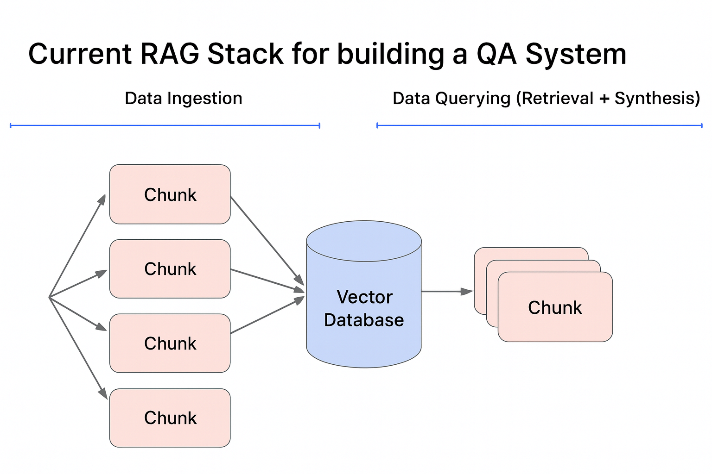

# 🔎 LangChain의 Chunk(Chunking) 정리

## 1. Chunk(Chunking)란?

* **정의**: 긴 문서를 \*\*작은 단위(Chunk)\*\*로 나누어 처리하는 것.
* **필요성**:

  * LLM은 입력 토큰 길이에 제한이 있음. (예: GPT-4는 128k 토큰까지 가능)
  * 검색(RAG)에서 **더 정확한 매칭**을 위해 작은 단위로 쪼개야 함.
* **비유**: 백과사전 한 권을 그대로 검색하면 비효율적이므로, **페이지나 문단 단위로 나눠서 관리**하는 것과 같음.

---

## 2. 왜 Chunking이 중요한가?

1. **LLM 입력 제한 극복**

   * 한 번에 너무 큰 문서를 넣을 수 없으므로 잘라야 함.
2. **검색 품질 향상**

   * 질문과 관련된 작은 단위를 가져오면 더 정밀한 답변 가능.
3. **비용 절감**

   * 불필요한 대규모 텍스트 입력을 줄여 API 호출 비용 절약.
4. **정확한 문맥 유지**

   * 문서를 너무 크게 넣으면 검색이 희석되고, 너무 작으면 문맥이 깨짐 → 적절한 Chunk 크기가 필요.

---

## 3. Chunking 기본 동작 원리

1. **Loader**: 원본 문서를 불러옴.
2. **Splitter**: 텍스트를 Chunk 단위로 분할.

   * `CharacterTextSplitter`
   * `RecursiveCharacterTextSplitter`
   * `TokenTextSplitter`
3. **Embedding**: 각 Chunk를 벡터화하여 Vector DB에 저장.
4. **검색(Retrieval)**: 질문과 가장 가까운 Chunk를 찾아 LLM에 제공.

---

## 4. LangChain에서 제공하는 주요 Splitter

* **CharacterTextSplitter**

  * 문자 수 기준으로 단순 분할.
  * 예: 1000자 단위로 잘라내기.

* **RecursiveCharacterTextSplitter** (가장 많이 사용)

  * 문단 → 문장 → 단어 순으로 **문맥을 유지하면서 분할**.
  * 텍스트 구조를 고려하여 더 자연스럽게 자름.

* **TokenTextSplitter**

  * 토큰 단위로 분할.
  * 모델의 실제 토큰화를 반영하여 더 정밀하게 컨트롤 가능.

* **Language-aware Splitters**

  * Python, Markdown 등 특정 포맷(코드/문서)을 고려하여 분할.

---

## 5. Chunk의 크기와 Overlap

* **Chunk Size**: 하나의 블록 크기 (예: 500\~1000자 or 256\~1024 토큰)
* **Chunk Overlap**: 문맥을 유지하기 위해 Chunk 간 일부 중복 포함.

  * 예: Chunk Size=1000, Overlap=200 → 앞뒤 문맥이 이어짐.

👉 일반적으로 **500\~1000 토큰 크기, 50\~200 토큰 Overlap**이 적당하다고 알려져 있음.

---

## 6. Chunking의 장점

* **검색 정밀도 향상**: 질문과 더 밀접한 부분만 검색 가능.
* **문맥 손실 최소화**: Overlap 활용으로 의미 연결성 유지.
* **효율성**: 문서를 작은 단위로 관리하므로 빠른 검색 가능.

---

## 7. Chunking의 한계

* **너무 작으면**: 문맥이 잘려서 불완전한 답변 발생.
* **너무 크면**: 검색이 부정확하고 토큰 낭비.
* **균형 조절 필요**: 문서 성격(법률 문서, 기술 문서, 소설 등)에 따라 최적값 달라짐.

---

## 8. Chunking 활용 사례

* **RAG 시스템**: 대형 보고서를 문단 단위로 나누어 검색 후 답변.
* **FAQ 챗봇**: 질문별로 Chunking 후 매칭.
* **문서 요약**: 긴 보고서를 Chunk 단위로 요약하고 최종 요약을 합성.
* **코드 분석**: 대형 코드베이스를 함수/클래스 단위로 Chunking.

---

## 9. Chunking Best Practices

* **문서 성격 고려**: 소설/에세이는 문단 중심, 기술 문서는 문장 중심.
* **Overlap 적극 활용**: Chunk 간 연결성을 유지.
* **Tokenizer 기반 분할**: 모델과 호환성 높임.
* **실험과 튜닝**: 도메인별 최적 Chunk 크기 다르므로 테스트 필요.

---

## 10. 앞으로의 발전 방향

* **Dynamic Chunking**: 질문 유형에 따라 Chunk 크기를 유동적으로 조정.
* **멀티모달 Chunking**: 텍스트 + 이미지 + 표 등을 함께 잘라내는 방식.
* **Adaptive Overlap**: 문서 구조에 따라 Overlap 크기를 자동 최적화.

---

👉 정리하면, \*\*Chunking은 “긴 문서를 LLM이 소화할 수 있는 작은 조각으로 잘라주는 과정”\*\*입니다.
LangChain에서는 Splitter를 이용해 이를 자동화하고, RAG의 **검색 정확도와 응답 품질을 좌우하는 핵심 단계**라고 할 수 있습니다.

---

주인님, 원하시면 제가 **Chunk 크기에 따른 검색/응답 품질 비교 예시**를 Python 코드로 시뮬레이션해서 보여드릴 수도 있는데, 해드릴까요?
