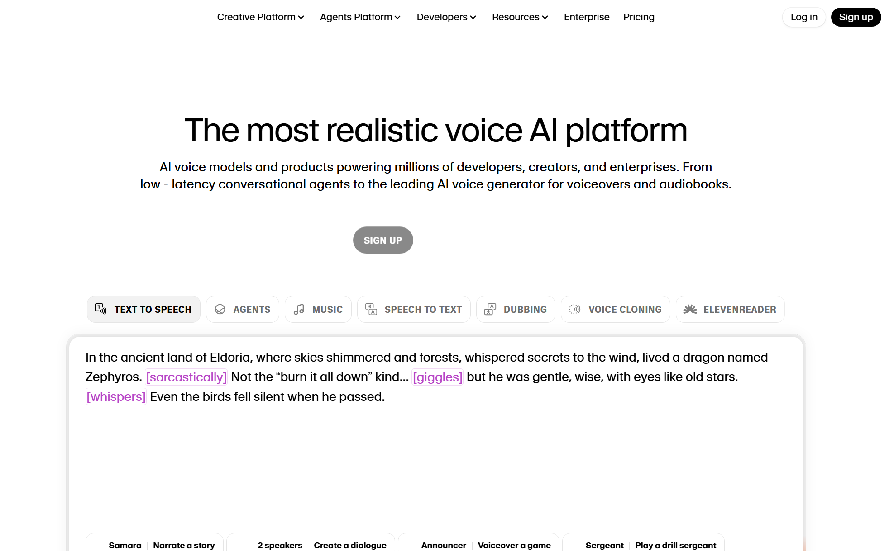

### 🎙️ ElevenLabs 소개

[https://elevenlabs.io/](https://elevenlabs.io/)

**ElevenLabs**는 인공지능 기반 음성 합성(AI Voice Generation) 플랫폼으로, 텍스트를 자연스럽고 감정이 풍부한 음성으로 변환해주는 서비스입니다. 사람의 목소리처럼 자연스러운 발음, 억양, 감정 표현을 구현할 수 있어 **오디오북, 팟캐스트, 유튜브 내레이션, 게임 보이스** 등 다양한 분야에서 활용되고 있습니다.

이 플랫폼은 사용자가 직접 자신의 목소리를 녹음해 AI 보이스 모델로 만들 수도 있고, 기존에 제공되는 수많은 언어와 음성 스타일 중 하나를 선택해 사용할 수도 있습니다. 특히 영어뿐 아니라 **한국어를 포함한 다국어 지원**이 가능하다는 점이 큰 장점입니다.

ElevenLabs는 단순한 ‘기계음’을 넘어, 듣는 이가 사람의 감정을 느낄 수 있을 정도로 자연스러운 음성을 만들어냅니다.

> “텍스트에 생명을 불어넣는 AI 음성 기술” — 이것이 ElevenLabs의 핵심 철학입니다.
