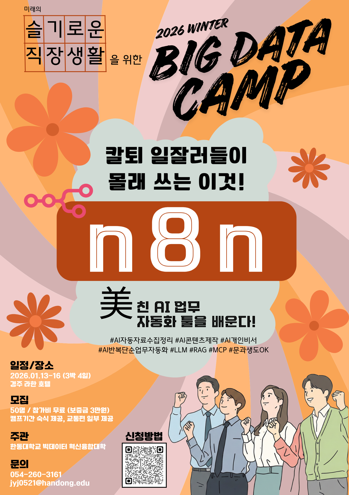

# 강사소개

제시해주신 이미지 속 **김영욱 강사님(Hello AI)**의 프로필 내용을 바탕으로, 요청하신 대로 텍스트 정보를 다시 정교하게 정리해 드립니다.

---

## 👤 김영욱 (Kim Young-wook) 강사 프로필

현재 인공지능 전문 기업인 Hello AI의 수장으로, 25년 이상의 경력을 보유한 IT 및 AI 전문가입니다. 과거 마이크로소프트(Microsoft)에서 13년 동안 핵심 기술 전문가로 활동하며 쌓은 내공을 바탕으로 현재는 AI 비즈니스 컨설팅, 강연, 집필 등 다방면에서 활약하고 있습니다.

**Hello AI 소속** 

### **1. 주요 약력 (Professional Experience)**

- **Hello AI 대표**: AI 개발 및 컨설팅 및 관련 과제를 수행하고 있으며 교육 업무도 진행하고 있다. 
- **Microsoft 엔지니어 (2008~2021)**: Technical Evangelist 및 Software Engineer 역임 
- **Microsoft 지역 이사 (Regional Director)** 활동 
- **Microsoft 사외 AI 전문가**: Microsoft Artificial Intelligence MVP (Most Valuable Professional) 
- **국가과학기술인력개발원(KIRD)**: 객원 교수 

### **2. 학력 (Education)**

- **서울 시립대학교**: 컴퓨터 과학 석사 학위 취득 

### **3. 주요 경력 및 외부 활동**

* **자문 및 프로젝트**:
* 웹 접근성 2.0 표준 자문위원 
* 디지털 교과서 프로젝트 리더 
* **출강 이력**:
* 한국방송통신대학교 출강 (2020년) 
* 인천재능대학교 출강 (2021년) 

* **수상 내역**:
* 국가과학기술인력개발원(KIRD) 최우수강사 선정 (2018년, 2020년) 

### **4. 주요 저서 (Publications)**
* **생성형 AI 사피엔스** 
* **가장 빨리 만나는 챗봇 프로그래밍** (with Bot Framework) 
* **War of IT**: 세계 비즈니스 판도를 바꾼 새로운 전쟁이 시작됐다! (지앤선 출판사) 

### **5. 전문 자격 및 인증 (Certifications)**
* **Microsoft Certified Trainer (MCT)**: 2020-2021 인증 
* **Microsoft Regional Director** 배지 보유 
* **Microsoft MVP (Most Valuable Professional)** 인증 
